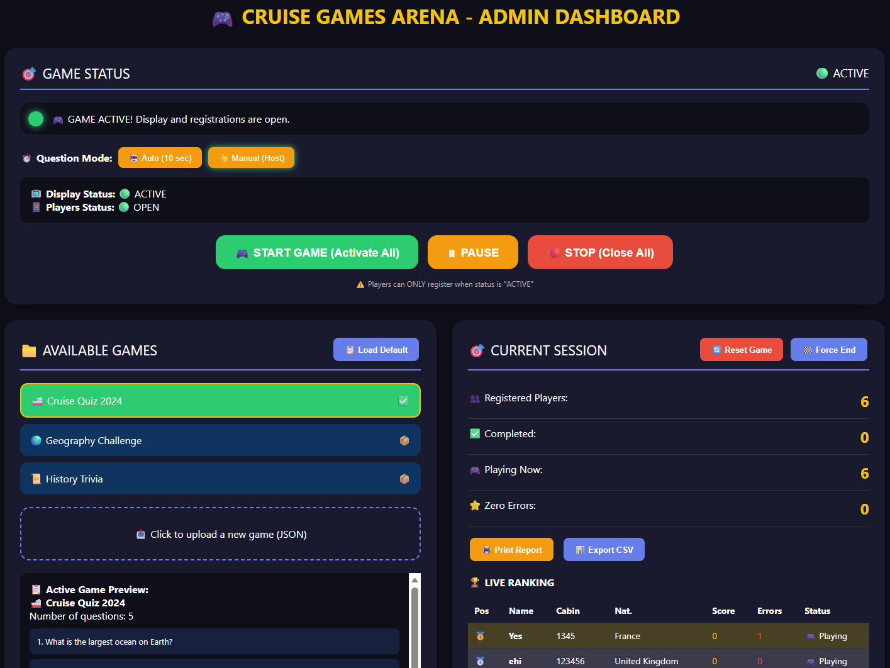
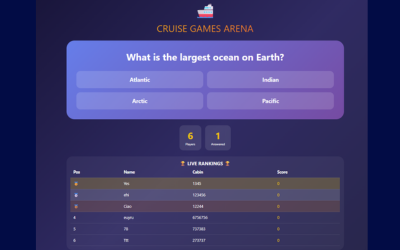
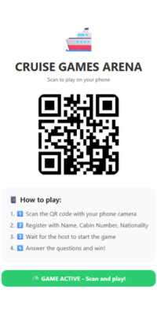

<!-- 
  CRUISE GAMES ARENA
  Professional Interactive Quiz System for Cruise Ships
  Version: 1.0.0 | Author: Carmine D'Alise
-->

<div align="center">

# 🚢 CRUISE GAMES ARENA

### Real-time Interactive Quiz System for Cruise Ships

[](https://cruise-games-arena.vercel.app)
[](https://firebase.google.com)
[](LICENSE)

<br>


</div>


## 📋 Table of Contents

- [What is Cruise Games Arena?](#what-is-cruise-games-arena)
- [Key Features](#key-features)
- [How It Works](#how-it-works)
- [System Architecture](#system-architecture)
- [Screenshots](#screenshots)
- [Live Demo](#live-demo)
- [Use Cases](#use-cases)
- [Included Games](#included-games)
- [Technology Stack](#technology-stack)
- [Quick Start](#quick-start)
- [Contact](#contact)

---

## 🎯 What is Cruise Games Arena?

**Cruise Games Arena** is a professional, real-time quiz system designed for cruise ship entertainment, resorts, hotels, and corporate events. 

Passengers play from their smartphones with **no app installation required**, while the crew controls everything from a simple, intuitive dashboard.

---

## ✨ Key Features

| Feature | Description |
|---------|-------------|
| 🎮 **Real-time Gameplay** | Instant scoring and live rankings |
| 🌐 **5 Languages** | English, Italian, French, German, Spanish |
| 📱 **No App Required** | Works entirely in web browser |
| 🏆 **Live Rankings** | Real-time leaderboard on public display |
| 🖨️ **PDF & CSV Reports** | One-click export of results |
| 🔄 **Multiple Games** | Easily add new quizzes via JSON |
| 🎯 **Game Control** | Start/Pause/Stop from admin panel |
| 👥 **Player Management** | Track names, cabins, nationalities |

---

## 🎮 How It Works

### For Passengers:
1. Scan QR code with phone camera
2. Register with Name, Cabin Number, Nationality
3. Select preferred language
4. Answer questions (10 per game)
5. Watch live rankings on public screen

### For Animator:
1. Select game from admin panel
2. Click START GAME to activate session
3. Show QR code on public screen
4. Advance questions (Auto/Manual mode)
5. Display rankings and winners
6. Export results as CSV or PDF

---

## 🏗️ System Architecture

### Network Components

| Component | Role | Technology |
|-----------|------|------------|
| 🖥️ **Admin Laptop** | Game control, monitoring | HTML, CSS, JavaScript |
| 📺 **Public Display** | Show questions & rankings | HTML, CSS, JavaScript |
| ☁️ **Firebase** | Real-time database | Firestore |
| 📱 **Passenger Phones** | Register & play | Mobile browser |

### Data Flow
Step 1: Animator starts game → Firebase status becomes "active"
Step 2: Passengers scan QR code → register with their details
Step 3: Passengers answer questions → scores saved to Firebase
Step 4: Firebase syncs in real-time → TV shows live rankings
Step 5: All players complete → system calculates winners automatically


### Real-time Performance

| Metric | Value |
|--------|-------|
| Registration time | Less than 1 second |
| Answer submission | Less than 1 second |
| Rankings update | Less than 1 second |
| Concurrent players | 100+ supported |

---

## 🖼️ Screenshots

<div align="center">

| Admin Dashboard | Public Display | Player View |
|:---:|:---:|:---:|
|  |  |  |

</div>
*Screenshots from the live demo system*
---

## 🚀 Live Demo

👉 **Try it yourself:** [https://cruise-games-arena.vercel.app](https://cruise-games-arena.vercel.app)

📱 **Scan QR to play:**

<div align="center">
  
  <br>
  <i>Scan with your phone camera</i>
</div>

---

## 🎯 Use Cases

| Industry | Application |
|----------|-------------|
| 🚢 **Cruise Ships** | Main entertainment, evening quizzes |
| 🏖️ **Resorts** | Poolside games, family activities |
| 🏨 **Hotels** | Guest engagement, welcome events |
| 🎪 **Corporate Events** | Team building, icebreakers |
| 🎓 **Education** | Interactive learning |

---

## 📦 Included Games

| Game | Questions | Difficulty |
|------|-----------|------------|
| 🚢 Cruise Quiz 2024 | 10 | Medium |
| 🌍 Geography Challenge | 10 | Hard |
| 📜 History Trivia | 10 | Medium |
| 🏝️ Destination Challenge | 10 | Easy |
| 🎬 Cinema & TV | 10 | Medium |
| 🎵 Music Trivia | 10 | Easy |
| ⚽ Sports Quiz | 10 | Medium |

---

## 🛠️ Technology Stack

| Layer | Technology |
|:-----:|:----------:|
| **Frontend** | HTML5, CSS3, JavaScript (ES6+) |
| **Backend** | Firebase Firestore (Real-time DB) |
| **Hosting** | Vercel / GitHub Pages |
| **QR Code** | QR Server API |
| **Version Control** | Git & GitHub |

### Firebase Free Tier (sufficient for cruise ships)

| Resource | Limit |
|----------|-------|
| Reads/day | 50,000 |
| Writes/day | 20,000 |
| Connections | 100 simultaneous |
| Storage | 1 GB |

---

## 🚀 Quick Start

### Prerequisites
- Firebase account (free)
- Git (optional)

### 1. Clone the repository
```bash
git clone https://github.com/iacreatorcar/Cruise-Games-Arena.git
cd Cruise-Games-Arena

👨‍💻 Contact & Inquiries
Interested in using this system for your cruise ship, resort, or event?

📧 Email	carmine@cdalise.com
🔗 GitHub	github.com/iacreatorcar
🌐 Website	cdalise.com
📄 License
MIT License - Free for commercial use on cruise ships, resorts, and events.

<div align="center">
⭐ If you find this project useful, please give it a star!
Made with ❤️ by Carmine D'Alise

© 2024 Cruise Games Arena

https://img.shields.io/github/stars/iacreatorcar/Cruise-Games-Arena?style=social

</div> ```
